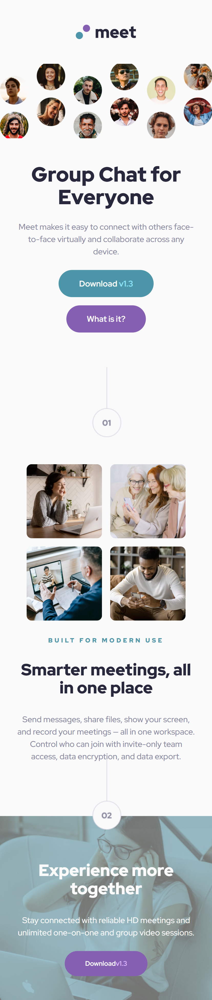
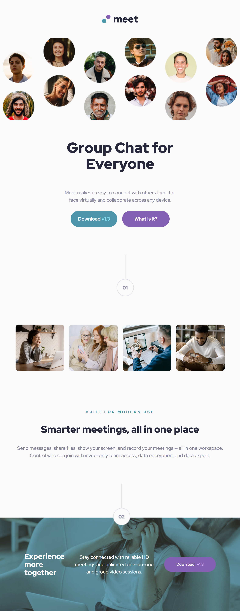
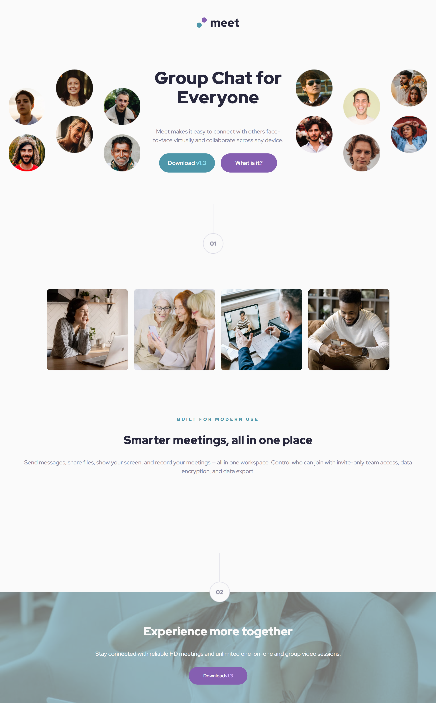

# Frontend Mentor - Meet landing page solution

This is my solution to the [Meet Landing Page challenge on Frontend Mentor](https://www.frontendmentor.io/challenges/meet-landing-page-rbTDS6OUR). I completed this challenge to practice my web development skills.

## Table of contents

- [Frontend Mentor - Meet landing page solution](#frontend-mentor---meet-landing-page-solution)
  - [Table of contents](#table-of-contents)
  - [Overview](#overview)
    - [The challenge](#the-challenge)
    - [Screenshot](#screenshot)
    - [Links](#links)
    - [Built with](#built-with)
    - [What I learned](#what-i-learned)
    - [Continued development](#continued-development)
    - [Useful resources](#useful-resources)
  - [Author](#author)

**Note: Delete this note and update the table of contents based on what sections you keep.**

## Overview

### The challenge

The main requirements were:
- Create this landing page as close to the design as possible
- Implement a responsive layout that works across different screen sizes

### Screenshot






### Links

- Solution URL: [Add solution URL here](https://your-solution-url.com)
- Live Site URL: [Add live site URL here](https://your-live-site-url.com)


### Built with

- Semantic HTML5 markup
- CSS custom properties
- Flexbox
- CSS Grid
- Mobile-first workflow


### What I learned

The main technical challenge I overcame was organizing elements within divs across different screen sizes. For example:
- In the header: elements stack vertically and center on mobile/tablet
- On larger screens: elements appear horizontally, vertically, and some new elements appear

Here's a code snippet I'm proud of:

```html
<header>
    
    <div class="harder__container">
      <div class="img__container img__container-esquerda"></div>
      <div class="content">
        <h1>Group Chat for Everyone</h1>
        <p>Meet makes it easy to connect with others face-to-face virtually...</p>
        <nav class="bottons">
          <a class="btn__download" href="#">Download <span>v1.3</span></a>
          <a class="btn__learn" href="#">What is it?</a>
        </nav>
      </div>
      <div class="img__container-direita"></div>
    </div>
</header>
```
```
```SCSS
@media (min-width: 1201px) {
    header {
        .harder__container {
            display: flex;
            flex-direction: row;
            .img__container {
                display: none;
            }
            .img__container-esquerda {
                display: block;
                width: 30vw;
                aspect-ratio: 9/7;
                background-image: url("../assets/desktop/image-hero-left.png");
                background-size: cover;
                background-position: center;
            }
            // Additional styles...
        }
    }
}
```

### Continued development

Areas I want to focus on in future projects:
- Improving responsive design skills
- Mastering SCSS for more efficient styling
- Landing page development techniques

### Useful resources

MDN Web Docs - For reliable HTML/CSS references
CSS-Tricks - For layout inspiration and solutions

## Author

- Website - [Mariana Candido](https://my-page-portifolio-i04g89cc8-mariana-candidos-projects.vercel.app/)
- Frontend Mentor - [@M4R0C4](https://www.frontendmentor.io/profile/M4R0C4)
- GitHub- [M4R0C4](https://github.com/M4R0C4)


